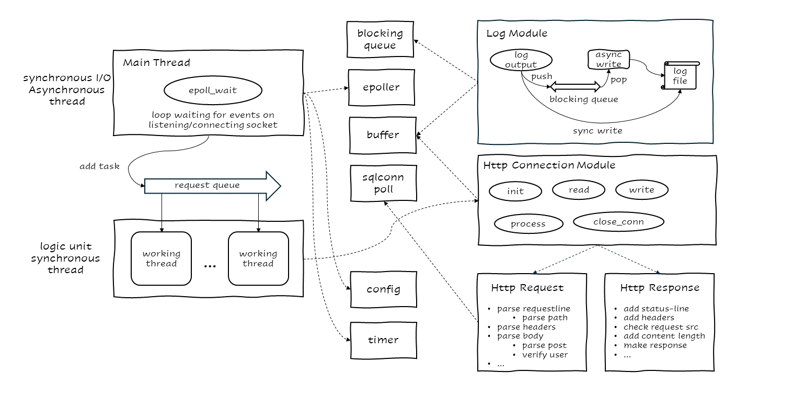

# WebServer

A high-performance WEB server implemented in C++, which can achieve tens of thousands of QPS after webbenchh stress test.

# Introduction
The implementation process of this project includes the following aspects:
- Use **half-synchronous/half-reactive pattern** to achieve high concurrency.
    - main thread: I/O multiplexing asynchronous thread
    - working threads: logic unit synchronous thread
- Synchronous I/O: Use the `epoll` series of system-calls to achieve **I/O multiplexing**.
- Encapsulate the standard library container `deque` to implement **blocking queue**.
- Encapsulate the standard library container `vector<char>` to implement an **automatically growing buffer**.
- Implement a **log module** that can write *asynchronously* or *synchronously*.
    - Asynchronous log writing is implemented using the *blocking queue* and *an independent writing thread*
- Use the **min heap** to implement a **timer container** for closing inactive connections that timeout.
- Implement **parsing of non-nested key-value pair configuration files** based on the standard library container `unordered_map`.
- Use the **thread pool** to store working threads to improve the efficiency of concurrent processing of requests.
- Implement a database **connection pool** to improve the efficiency of customer requests to the database.
    - Use the **RAII**(Resource Acquisition Is Initialization) mechanism to obtain connections from the pool.
- Encapsulate each http request into an http connection object.
    - Use the **FSM (finite state machine)** and **regular expression** to parse http requests



# Build and Run

```bash
git clone https://github.com/fansuregrin/WebServer.git WebServer
cd ./WebServer/src
make
../bin/server [YOUR_SERVER_CONFIG_FILE]
```

# TODO Lists
- [ ] Use `gtest` to re-write test code. 

# Acknowledgements
- [TinyWebServer](https://github.com/qinguoyi/TinyWebServer)
- [WebServer](https://github.com/markparticle/WebServer)
- [《Linux 高性能服务器编程》](https://course.cmpreading.com/web/refbook/detail/5068/208) writen by **游双**